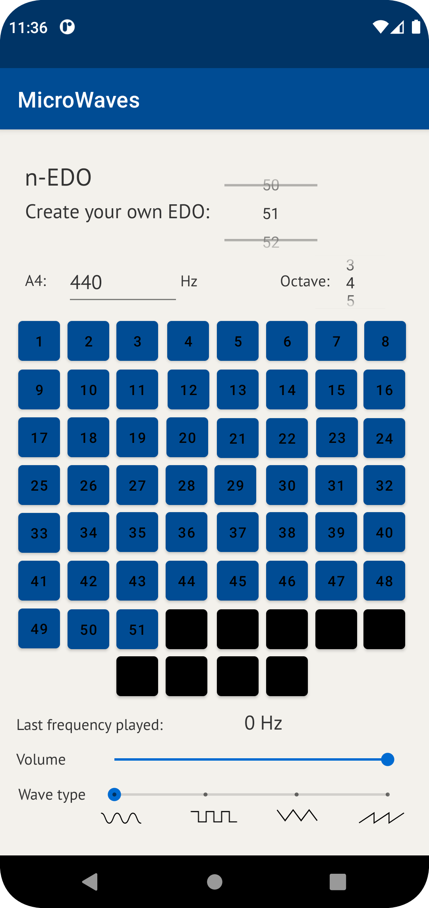

# MicroWaves - Microtonal Android App
Android app for the exploration and creation of microtonal tunings.

Bachelor's thesis project in Music Informatics, developed under the Music Informatics Laboratory of the University of Milan (https://play.google.com/store/apps/dev?id=5903521199026518477).

Available here: https://play.google.com/store/apps/details?id=com.unimi.lim.microwaves&hl=it&gl=US

 
The program is split into two primary sections: one presents ideas connected to temperament and microtonal theory, and the other gives the user a choice of keyboards to experiment with alternative tuning schemes.
 

When the app is first opened, the user is shown a homepage with two buttons to select the area of the app they want to utilize. 
 
 

The octave and the center frequency (default A4 = 440Hz), from which the selected temperament's notes will be formed, can be chosen.
Additionally, the required number of octave subdivisions can be selected in the n-EDO parametric mode.

The keyboard's buttons, which enable the user to interact with the chosen tuning system, are located in the section below.
The quantity of them depends on the tuning. They are all numbered from the lowest frequency, inside the chosen octave, to the highest.

As the user presses a button, a frequency will be generated, which will then be halted when the button is released. 

 
 
 
To learn more about equal temperament or unequal tuning systems, the user can read a brief introduction to temperament and microtonality in the app's theory section.

